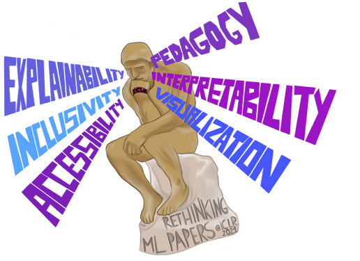

---
# Feel free to add content and custom Front Matter to this file.
# To modify the layout, see https://jekyllrb.com/docs/themes/#overriding-theme-defaults

permalink: /
title: Home
layout: home
---

<!-- 
<figure>
	

		
		<figcaption>Image Credits: <a href="https://falaaharifkhan.github.io/research/">Falaah Arif Khan</a></figcaption>
	

</figure>
-->

Algorithmic decision-making systems are increasingly used in sensitive applications such as advertising, resume reviewing, employment, credit lending, policing, criminal justice, and beyond. The long-term promise of these approaches is to automate, augment and/or eventually improve on the human decisions which can be biased or unfair, by leveraging the potential of machine learning to make decisions supported by historical data. Unfortunately, there is a growing body of evidence showing that the current machine learning technology is vulnerable to privacy or security attacks, lacks interpretability, or reproduces (and even exacerbates) historical biases or discriminatory behaviors against certain social groups.

Most of the literature on building socially responsible algorithmic decision-making systems focus on a static scenario where algorithmic decisions do not change the data distribution. However, real-world applications involve nonstationarities and feedback loops that must be taken into account to measure and mitigate fairness in the long-term. These feedback loops involve the learning process which may be biased because of insufficient exploration, or changes in the environment's dynamics due to strategic responses of the various stakeholders. From a machine learning perspective, these sequential processes are primarily studied through counterfactual analysis and reinforcement learning.

The purpose of this workshop is to bring together researchers from both industry and academia working on the full spectrum of responsible decision-making in dynamic environments, from theory to practice. In particular, we encourage submissions on the following topics:
* Fairness,
* Privacy and security,
* Robustness,
* Conservative and safe algorithms,
* Explainability and interpretability.

### Invited Speakers 
 
<figure>
	

	  <table style="border-collapse: collapse; border: none;">
	  	
		    <tr style="border: none;">
		        <td style="border: none;">
		            

		                

		                	
		                    	
		                    
		                    	
		                    
		                

		            

		        </td>
    		    <td style="border: none;">
		            

		            	<!-- Speaker name (link to webpage if provided) -->
		            	
		            		<b><a href="{{ speaker.webpage }}" target="_blank">{{ speaker.name }}</a></b>
		            	
		            		<b>{{ speaker.name }}</b>
		            	
		                 
		                <!-- Speaker affiliation (if provided) -->
		                
		                	<a href="{{ speaker.affil_link }}" target="_blank">{{ speaker.affil }}</a>
		                
		                	{{ speaker.affil }}
		                
		                <!-- Additional speaker affiliation (if provided) -->
		                
		                	 
		                	<a href="{{ speaker.affil2_link }}" target="_blank">{{ speaker.affil2 }}</a>
		                
		                	 
		                	{{ speaker.affil2 }}
		                
		            

		        </td>
		        <td style="border: none;">
		        	

		        		{{ speaker.content }}
		        	

		        </td>
		    </tr>
	    
	  </table>
  

</figure>

### News

* Accepted papers and talks are now [visible](papers). 
* Camera-ready and video submission deadlines are updated in [important dates](submit).
* Notifications for Accepted papers are out.   
* Call for papers is out! Last date to submit is **May 31, 2022**. Please check [instructions](submit) on how to submit.

<!--
* [Schedule](schedule) updated. 
* Accepted papers and reviews [available](papers)
* Thank you [reviewers](people/#reviewers)! 
-->

### Contact us

The organizers may be reached at `responsibledecisionmaking <AT> gmail <DOT> com`

[Follow us on Twitter](https://twitter.com/responsibledec1)!

### Related past workshops

1. [Socially Responsible Machine Learning (SRML)](https://iclrsrml.github.io/) - ICLR, 2022
2. [Socially Responsible Machine Learning](https://icmlsrml2021.github.io/) - ICML, 2021
3. [Learning in Presence of Strategic Behavior](https://sites.google.com/view/strategicml/) - NeurIPS, 2021
4. [Workshop on Responsible AI ](https://sites.google.com/view/rai-workshop/home) - ICLR, 2021
5. [Workshop on Consequential Decision Making in Dynamic Environments](https://dynamicdecisions.github.io/) - NeurIPS, 2020
6. [Law & Machine Learning (LML)](https://sites.google.com/view/icml-law-and-ml-2020/home) - ICML, 2020
7. [Workshop on Human Interpretability in Machine Learning (WHI)](https://sites.google.com/view/whi2020) - ICML, 2020 
8. [Reinforcement Learning for Real Life Workshop](https://sites.google.com/view/RL4RealLife) - ICML, 2021
9. [Safe and Robust Control of Uncertain Systems](https://sites.google.com/view/safe-robust-control/home) - NeurIPS, 2021 
10. [Political Economy of Reinforcement Learning (PERLS) Workshop
](https://perls-workshop.github.io/) - NeurIPS, 2021